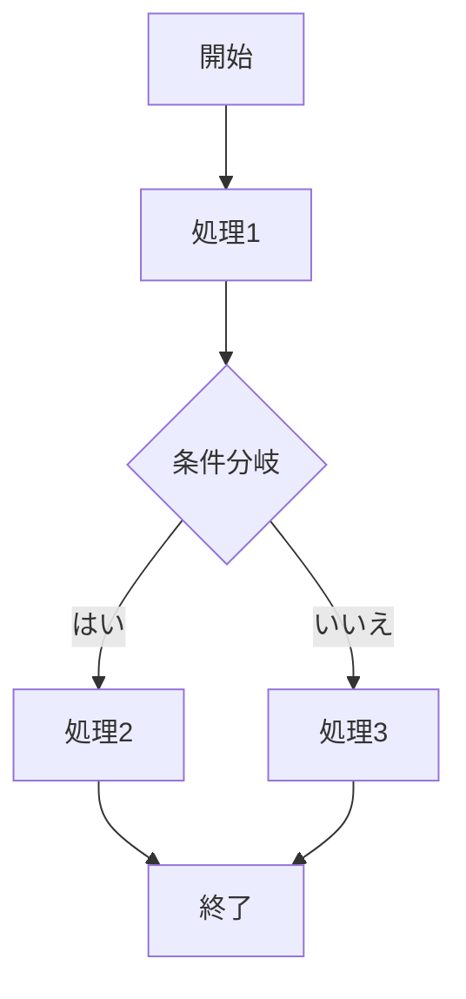
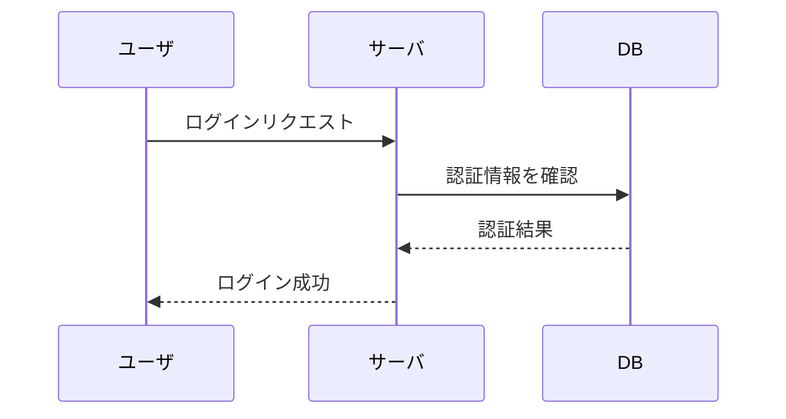
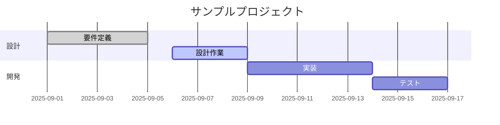
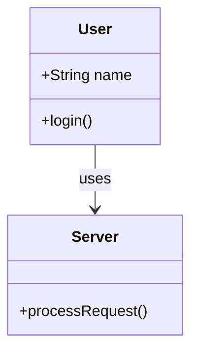

# マーメイド記法について学ぶ
## はじめに
マーメイド記法（Mermaid.js）は、Markdownファイルの中に図を直接書き込める便利な記法である。
フローチャートやシーケンス図などをテキストで表現できるため、設計資料や学習メモに役立つ。

本記事では、マーメイド記法を学び始めるための第一歩として、その基本と簡単な例を実際に書いてみる。

---

## 1. マーメイド記法とは
MermaidはJavaScriptライブラリであり、テキストベースで図を描画する。
GitHub、GitLab、Obsidian、VSCodeなど、多くの環境でサポートされている。

記法は次のようにMarkdownのコードブロックに `mermaid` を指定するだけでよい。

_sample of mermaid_

---
## 2. フローチャート（Flowchart）
フローチャートが書ける。

_sample of flowchart

- 'flowchart TD' : 上から下（Top to Down）に描画
- 他に 'LR'（左→右）, 'RL'（右→左）, 'BT'（下→上）も指定可能。
- 'A[ ]' : 四角いノード
- 'C{ }' : ひし形ノード（条件分岐）
-  '-->' : 矢印
- '|はい|' : 矢印にラベルを追加_

---
## 3. シーケンス図（Sequence Diagram）
システムやユーザ間のやり取りを時系列で表現する。

- 'nparticipant' : 登場人物やシステムを定義
- '->>' : メッセージ送信
- '-->>' : 応答メッセージ
---
---
## 4. ガントチャート（Gantt Chart）
プロジェクト計画やスケジュールに役立つ。

- 'dateFormat' : 日付のフォーマット

- 'section' : セクション区切り

- ':done / :active' : 進捗状態を指定
---
## 5. クラス図（Class Diagram）
オブジェクト指向設計に使えるクラス図も描ける。

- 'classDiagram' : クラス図開始

- '+' : public, '-' : private

- '-->' : 関連

---
