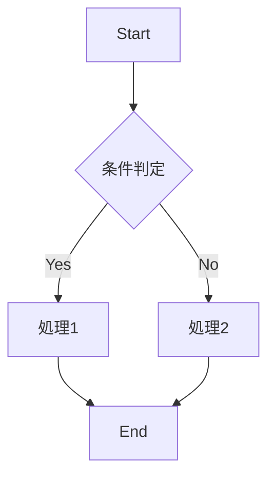

# マーメイド記法について学ぶ
## はじめに
マーメイド記法（Mermaid.js）は、Markdownファイルの中に図を直接書き込める便利な記法である。
フローチャートやシーケンス図などをテキストで表現できるため、設計資料や学習メモに役立つ。

本記事では、マーメイド記法を学び始めるための第一歩として、その基本と簡単な例を実際に書いてみる。

---

## 1. マーメイド記法とは
MermaidはJavaScriptライブラリであり、テキストベースで図を描画する。
GitHub、GitLab、Obsidian、VSCodeなど、多くの環境でサポートされている。

記法は次のようにMarkdownのコードブロックに `mermaid` を指定するだけでよい。

```txt
graph TD
  A[Start] --> B{条件判定}
  B -- Yes --> C[処理1]
  B -- No  --> D[処理2]
  C --> E[End]
  D --> E[End]
```


